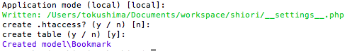
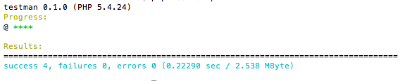
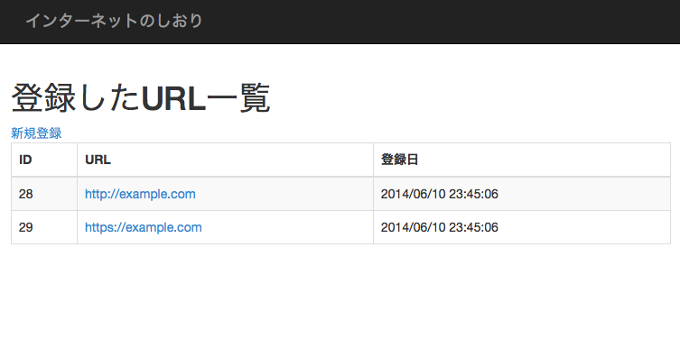

Shiori for ebi
======


@see https://github.com/sugamasao/Shiori


##Installation:

/Users/tokushima/Documents/workspace/

```
$ curl -sS https://getcomposer.org/installer | php
```

```
$ git clone https://github.com/tokushima/shiori.git shiori
$ cd shiori
```


```
$ curl -LO http://git.io/cmdman.phar
$ php cmdman.phar ebi.Dt::setup
```




##Start the development server:

```
$ php -S localhost:8000
```


##Test
```
$ curl -LO http://git.io/testman.phar
$ php testman.phar
```




##Shiori
```
http://localhost:8000/urls.php
```



